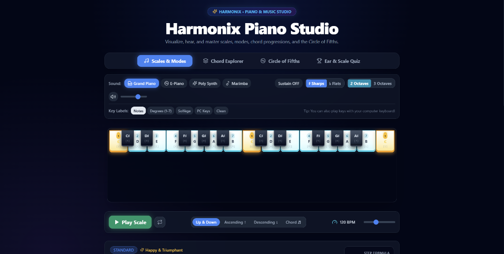

# 🎹 Harmonix Piano Studio

<div align="center">



**Interactive Piano, Scale Visualizer, Chord Progressions & Ear Training Studio**

[](https://saurabh28102006-pixel.github.io/piano-scale-visualizer/)
[](https://reactjs.org/)
[](https://www.typescriptlang.org/)
[](https://tailwindcss.com/)
[](https://vitejs.dev/)

[🚀 **Launch Live App**](https://saurabh28102006-pixel.github.io/piano-scale-visualizer/) • [✨ Features](#-features) • [⌨️ Keyboard Controls](#-keyboard-shortcuts) • [🛠️ Getting Started](#-getting-started)

</div>

---

## 🌟 Overview

**Harmonix Piano Studio** is an educational and interactive music theory workstation built for musicians, producers, teachers, and music learners. Visualize scales, hear harmonies across multiple instruments, explore chord progressions, study the Circle of Fifths, and practice your ear with interactive music quizzes.

---

## ✨ Features

### 🎹 1. 4 Realistic Sound Instruments (Web Audio Engine)
- **Grand Piano**: Multi-harmonic additive synthesis with authentic hammer strike attack and acoustic body resonance.
- **Electric Piano / Rhodes**: Bell chime harmonics with warm vibrato.
- **Poly Synth**: Dual-oscillator analog synth with low-pass filter resonance.
- **Marimba / Music Box**: Wooden percussive strike with bright transient decay.
- **Sustain Pedal**: Toggle sustain to hold and ring out notes naturally.
- **Master Volume**: Smooth master volume slider and instant mute toggle.

### ⚡ 2. Scale Auto-Player & Arpeggiator
- **Play Scale Engine**: Real-time visual animated piano key sequencer.
- **Playback Directions**: Ascending (↑), Descending (↓), Up & Down, and Simultaneous Chord (♬).
- **Tempo Control**: Adjustable BPM slider (60 to 220 BPM) with optional continuous looping.

### 🏷️ 3. Dynamic Key Label Customization
- **Notes**: Note names (`C`, `D`, `E`...) with instant **♯ Sharps** vs **♭ Flats** toggle.
- **Scale Degrees**: Degree numbers (`1`, `2`, `♭3`, `4`, `5`, `♭6`, `♭7`...) on each scale note.
- **Solfège**: Western Solfège names (`Do`, `Re`, `Mi`, `Fa`, `Sol`, `La`, `Ti`).
- **PC Keys**: Visual overlay of computer keyboard shortcuts.
- **Clean**: Minimalist piano look.
- **Octaves**: Switch between **2 Octaves** (C3-C5) and **3 Octaves** (C2-C5).

### 📚 4. 24+ Scales, Modes & Instant Search
- **Standard Scales**: Major (Ionian), Natural Minor (Aeolian), Harmonic Minor, Melodic Minor.
- **Pentatonic & Blues**: Major Pentatonic, Minor Pentatonic, Blues Scale, Major Blues.
- **Modes of Major Scale**: Ionian, Dorian, Phrygian, Lydian, Mixolydian, Aeolian, Locrian.
- **Jazz & Exotic**: Bebop Dominant, Bebop Major, Whole Tone, Diminished (Half-Whole & Whole-Half), Hungarian Minor, Spanish Gypsy (Phrygian Dominant), Japanese (Hirajoshi), Double Harmonic (Arabic).
- **Search & Filter**: Search scales instantly by name or musical mood.

### 🎼 5. Scale Theory & Diatonic Chords Generator
- Complete step pattern formula (e.g. `W-W-H-W-W-W-H`), mood tags, and musical description.
- **Clickable Scale Notes**: Click any note card in the scale to hear it.
- **Diatonic Chords (`I`, `ii`, `iii`, `IV`, `V`, `vi`, `vii°`)**: Click any chord card to hear its 4-note chord harmony in real time.

### 🎸 6. Dedicated Chord Explorer Mode
- Explore **13+ Chord Types** (Major, Minor, 7th, Maj7, Min7, Diminished, Augmented, Sus2, Sus4, add9, 9th, etc.).
- 1-click **Play Chord Strum** and **Arpeggiate**.

### ⭕ 7. Interactive Circle of Fifths
- Interactive SVG Circle of Fifths wheel.
- Click any Major key (outer ring) or Relative Minor key (inner ring) to instantly explore its scale.
- Displays key signatures, accidentals count, and relative major/minor keys.

### 🏆 8. Ear Training & Music Theory Quiz
- Test your ear and scale knowledge with interactive questions:
  - *Identify notes in/out of scale*
  - *Identify scale degrees*
  - *Step pattern formulas*
- Live score counter, streak tracker, sound effects, and detailed explanations.

---

## ⌨️ Computer Keyboard Shortcuts

Play the piano keys directly using your physical computer keyboard:

| Note | Key (Lower Octave) | Note | Key (Main Octave) |
| :--- | :---: | :--- | :---: |
| **C3** | `Z` | **C4** | `Q` |
| **C#3** | `S` | **C#4** | `2` |
| **D3** | `X` | **D4** | `W` |
| **D#3** | `D` | **D#4** | `3` |
| **E3** | `C` | **E4** | `E` |
| **F3** | `V` | **F4** | `R` |
| **F#3** | `G` | **F#4** | `5` |
| **G3** | `B` | **G4** | `T` |
| **G#3** | `H` | **G#4** | `6` |
| **A3** | `N` | **A4** | `Y` |
| **A#3** | `J` | **A#4** | `7` |
| **B3** | `M` | **B4** | `U` |
| **C5** | `I` | | |

---

## 🛠️ Getting Started

### Prerequisites
- Node.js (v18 or higher)
- npm or bun

### Installation

```bash
# 1. Clone the repository
git clone https://github.com/saurabh28102006-pixel/piano-scale-visualizer.git

# 2. Navigate to directory
cd piano-scale-visualizer

# 3. Install dependencies
npm install

# 4. Start local development server
npm run dev
```

Open [http://localhost:8080](http://localhost:8080) to view it in your browser.

### Build & Deploy

```bash
# Build for production
npm run build

# Deploy to GitHub Pages
npm run deploy
```

---

## 🚀 Tech Stack

- **Framework**: [React 18](https://reactjs.org/) + [TypeScript](https://www.typescriptlang.org/)
- **Build Tool**: [Vite](https://vitejs.dev/)
- **Styling**: [Tailwind CSS](https://tailwindcss.com/)
- **Icons**: [Lucide React](https://lucide.dev/)
- **Audio**: Web Audio API (Multi-Oscillator Harmonic Synthesis)
- **Deployment**: [GitHub Pages](https://pages.github.com/)

---

## 👤 Author

Designed and Developed by **Saurabh Kumar**
- GitHub: [@saurabh28102006-pixel](https://github.com/saurabh28102006-pixel)

---

## 📄 License

This project is licensed under the MIT License.
